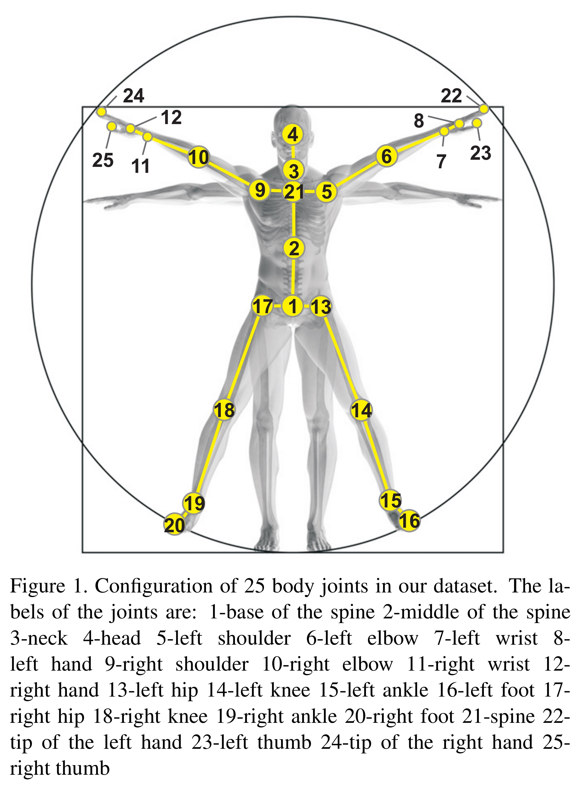

This file is used as instructor assisting you cleaning the data that you need. Part of the data preprocessing code comes from [here](https://github.com/shahroudy/NTURGB-D).

1. specify the data location of your NTU-RGBD120 dataset and the file direction to output files. then run `txt2npy.py` using `python txt2npy.py`, transferring the `.skeleton` data into `.npy` data
    - The data can be then loaded into dictionary using
    ```python
    data = np.load('./SxxxCxxxPxxxRxxxAxxx.skeleton.npy',allow_pickle=True).item()
    ```
    - Each file/folder name in both datasets is in the format of SsssCcccPpppRrrrAaaa (e.g., S001C002P003R002A013), in which sss is the setup number, ccc is the camera ID, ppp is the performer (subject) ID, rrr is the replication number (1 or 2), and aaa is the action class label.
    - The configuration of skeleton is viewed as: 
    - NTU-60 contain A1 till A60, while NTU-120 contain A1 till A120, where the types of motions are: 
        - A1: drink water.
        - A2: eat meal/snack.
        - A3: brushing teeth.
        - A4: brushing hair.
        - A5: drop.
        - A6: pickup.
        - A7: throw.
        - A8: sitting down.
        - A9: standing up (from sitting position).
        - A10: clapping.
        - A11: reading.
        - A12: writing.
        - A13: tear up paper.
        - A14: wear jacket.
        - A15: take off jacket.
        - A16: wear a shoe.
        - A17: take off a shoe.
        - A18: wear on glasses.
        - A19: take off glasses.
        - A20: put on a hat/cap.
        - A21: take off a hat/cap.
        - A22: cheer up.
        - A23: hand waving.
        - A24: kicking something.
        - A25: reach into pocket.
        - A26: hopping (one foot jumping).
        - A27: jump up.
        - A28: make a phone call/answer phone.
        - A29: playing with phone/tablet.
        - A30: typing on a keyboard.
        - A31: pointing to something with finger.
        - A32: taking a selfie.
        - A33: check time (from watch).
        - A34: rub two hands together.
        - A35: nod head/bow.
        - A36: shake head.
        - A37: wipe face.
        - A38: salute.
        - A39: put the palms together.
        - A40: cross hands in front (say stop).
        - A41: sneeze/cough.
        - A42: staggering.
        - A43: falling.
        - A44: touch head (headache).
        - A45: touch chest (stomachache/heart pain).
        - A46: touch back (backache).
        - A47: touch neck (neckache).
        - A48: nausea or vomiting condition.
        - A49: use a fan (with hand or paper)/feeling warm.
        - A50: punching/slapping other person.
        - A51: kicking other person.
        - A52: pushing other person.
        - A53: pat on back of other person.
        - A54: point finger at the other person.
        - A55: hugging other person.
        - A56: giving something to other person.
        - A57: touch other person's pocket.
        - A58: handshaking.
        - A59: walking towards each other.
        - A60: walking apart from each other.
        - A61: put on headphone.
        - A62: take off headphone.
        - A63: shoot at the basket.
        - A64: bounce ball.
        - A65: tennis bat swing.
        - A66: juggling table tennis balls.
        - A67: hush (quite).
        - A68: flick hair.
        - A69: thumb up.
        - A70: thumb down.
        - A71: make ok sign.
        - A72: make victory sign.
        - A73: staple book.
        - A74: counting money.
        - A75: cutting nails.
        - A76: cutting paper (using scissors).
        - A77: snapping fingers.
        - A78: open bottle.
        - A79: sniff (smell).
        - A80: squat down.
        - A81: toss a coin.
        - A82: fold paper.
        - A83: ball up paper.
        - A84: play magic cube.
        - A85: apply cream on face.
        - A86: apply cream on hand back.
        - A87: put on bag.
        - A88: take off bag.
        - A89: put something into a bag.
        - A90: take something out of a bag.
        - A91: open a box.
        - A92: move heavy objects.
        - A93: shake fist.
        - A94: throw up cap/hat.
        - A95: hands up (both hands).
        - A96: cross arms.
        - A97: arm circles.
        - A98: arm swings.
        - A99: running on the spot.
        - A100: butt kicks (kick backward).
        - A101: cross toe touch.
        - A102: side kick.
        - A103: yawn.
        - A104: stretch oneself.
        - A105: blow nose.
        - A106: hit other person with something.
        - A107: wield knife towards other person.
        - A108: knock over other person (hit with body).
        - A109: grab other person’s stuff.
        - A110: shoot at other person with a gun.
        - A111: step on foot.
        - A112: high-five.
        - A113: cheers and drink.
        - A114: carry something with other person.
        - A115: take a photo of other person.
        - A116: follow other person.
        - A117: whisper in other person’s ear.
        - A118: exchange things with other person.
        - A119: support somebody with hand.
        - A120: finger-guessing game (playing rock-paper-scissors).

    - Inside the dictionary, the key-value pairs mean:
        - `file_name`: file's name
        - `nbodys`: it's a list with same length of the sequence. it represents the number of the actors in each frame.
        - `njoints`: the number of the joint node in the skeleton, it's a constant here
        - `skel_bodyx`: the skeleton coordinate with the shape of `(nframe, njoint, 3)`, the x denotes the id of the acting person in each frame.
        - `rgb_bodyx`: the projection of the skeleton coordinate in RGBs.
        - `depth_bodyx`: the projection of the skeleton coordinate in Depths

2. specify the classes that you want to extract in list (exampled as `full.txt`), then run `extract.py` using `python extract.py`, selecting data of specific type, rename, and save as `.pt` file or `.npy` file.
    - Here we only extract the first body of each skeletons.
    - Data sampled to extract are `.npy` files, stored in `transferred`.

3. convert the skeleton data into left-arm angles using `convert.py`, and save the converted angles as `.pkl` file. The processed data can be approached [here](https://drive.google.com/drive/folders/1gt0LjVJvBQtYEwMVV-0r3qKxqU3RwlFb)

4. The unprocessed data can be viewed [in this page](https://drive.google.com/drive/folders/15-IK5fRih2VpTcmW5ksfpPBJIw5sMdnA) or in these two pages ([1](https://drive.google.com/file/d/1CUZnBtYwifVXS21yVg62T-vrPVayso5H/view) and [2](https://drive.google.com/file/d/1tEbuaEqMxAV7dNc4fqu1O4M7mC6CJ50w/view))